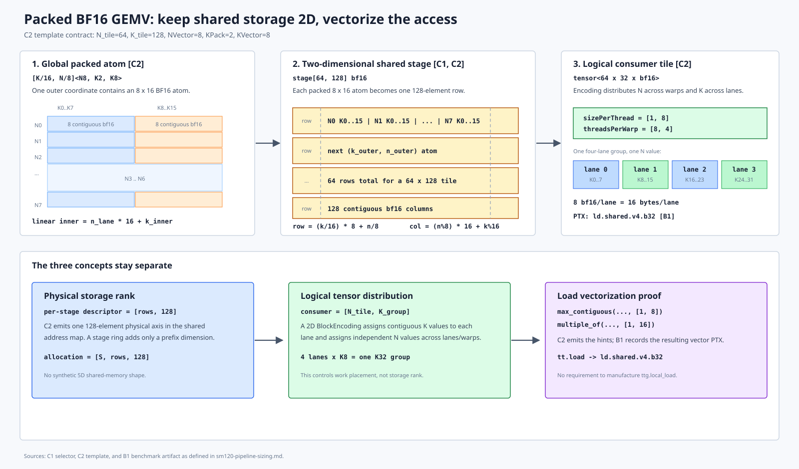
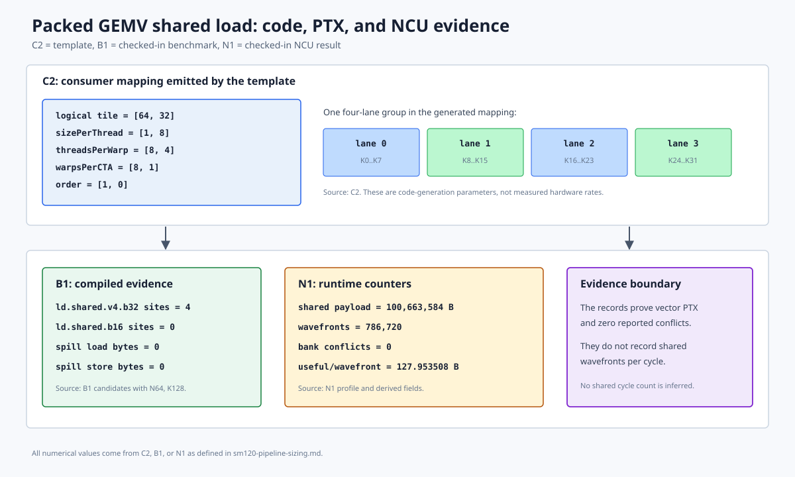
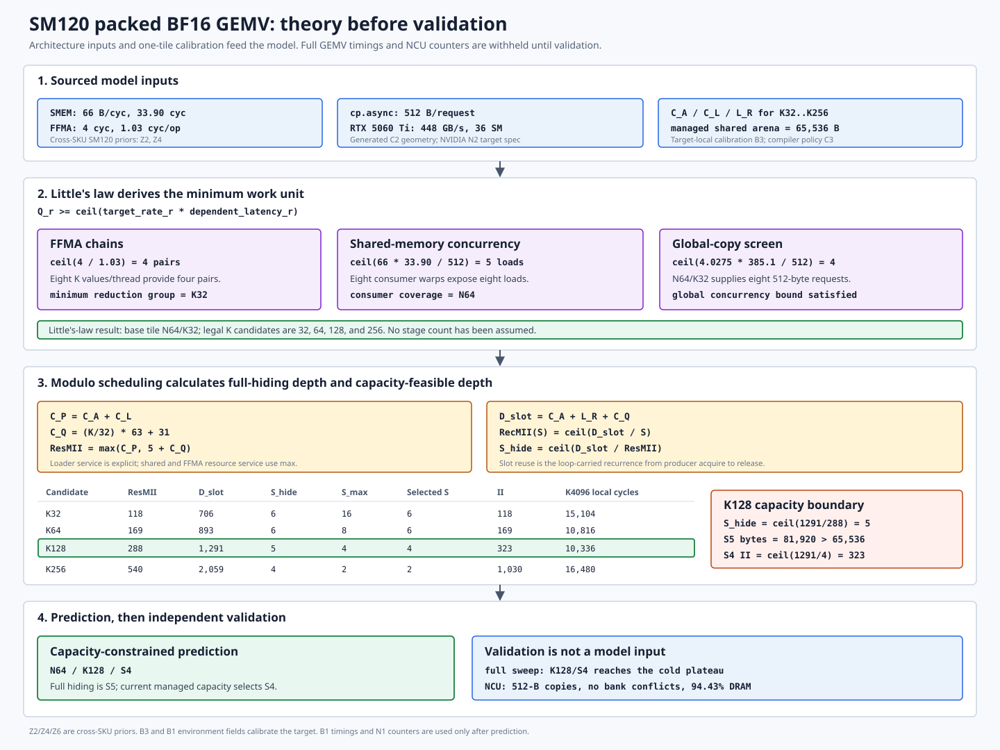
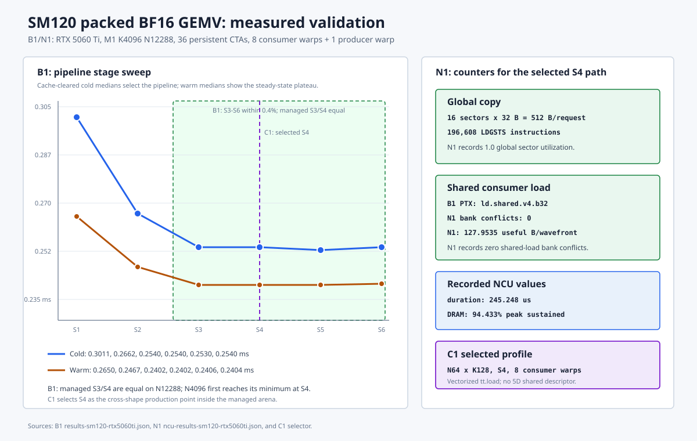

# SM120 Packed GEMV Pipeline Sizing

This note derives the current PyNTT BF16 packed GEMV configuration:

```text
N_tile = 64
K_tile = 128
num_stages = 4
producer warps = 1
consumer warps = 8
```

The argument is intentionally ordered as follows:

1. State every architecture, compiler, and calibration input, with its source.
2. Use Little's law to derive the minimum independent work and therefore the
   minimum legal tile granularity.
3. Use resource- and recurrence-constrained modulo scheduling to calculate the
   stage depth for each legal K tile.
4. Apply the compiler-managed shared-memory capacity and select the predicted
   best feasible `(K_tile, num_stages)` pair.
5. Only then run the full GEMV sweep and NCU experiment to test the prediction.

The unconstrained modulo schedule requires **five stages** for `K128`. The
compiler-managed 64-KiB arena can hold only four `K128` stages. After applying
that capacity constraint, the model predicts `K128/S4` as the best feasible
pair. This distinction is important: `S5` is the calculated full-hiding depth,
while `S4` is the capacity-constrained production choice.

## 1. Evidence and provenance

The identifiers below are attached to numerical inputs throughout the note.

| ID | Source | Information used |
| --- | --- | --- |
| **C1** | [TritonTIRMicroKernelSelector.cs](../../../../modules/Nncase.Modules.NTT/Targets/TritonTIRMicroKernelSelector.cs) | Production tile, stage count, and shared-workspace contract. |
| **C2** | [simt_fma_smem_pipeline.py.jinja](../../../../pyntt/pyntt/codegen/templates/triton/kernels/matmul/simt_fma_smem_pipeline.py.jinja) | Producer/consumer mapping, copy geometry, shared layout, and reduction implementation. |
| **C3** | [NTTTargetMachineCatalog.cs](../../../../modules/Nncase.Modules.NTT/Targets/NTTTargetMachineCatalog.cs) | Physical and compiler-managed shared-memory capacities. |
| **B1** | [results-sm120-rtx5060ti.json](results-sm120-rtx5060ti.json) | Target environment, full candidate sweep, and compiled-kernel metadata. Only environment fields are model inputs; candidate timings are used in validation. |
| **B2** | [benchmark_pipeline.py](benchmark_pipeline.py) | Correctness and timing protocol that produced B1. |
| **B3** | [trace-results-sm120-rtx5060ti.json](trace-results-sm120-rtx5060ti.json) | Target-local one-tile model calibration and persistent trace summary. |
| **B4** | [trace_pipeline.py](trace_pipeline.py) | `%clock64` instrumentation and component probes that produced B3. |
| **N1** | [ncu-results-sm120-rtx5060ti.json](ncu-results-sm120-rtx5060ti.json) | Full-kernel transaction and bandwidth counters. Used only in validation. |
| **N2** | [NVIDIA RTX 5060 family specifications](https://www.nvidia.com/en-us/geforce/graphics-cards/50-series/rtx-5060-family/) | RTX 5060 Ti theoretical memory bandwidth, 448 GB/s. |
| **Z1** | [SM120 microbenchmark index](https://zartbot.github.io/micro_arch/nvidia/sm_120/index.html) | External test platform and report index. |
| **Z2** | [Memory subsystem](https://zartbot.github.io/micro_arch/nvidia/sm_120/02_memory_subsystem.html) | Shared-memory bandwidth/latency and `cp.async` completion sweep. |
| **Z3** | [SM microarchitecture](https://zartbot.github.io/micro_arch/nvidia/sm_120/03_sm_microarchitecture.html) | Four-SMSP organization and FMA/LSU overlap. |
| **Z4** | [Instruction characterization](https://zartbot.github.io/micro_arch/nvidia/sm_120/05_instruction_level_characterization.html) | FFMA dependency latency and independent-chain throughput. |
| **Z5** | [On-chip network and async](https://zartbot.github.io/micro_arch/nvidia/sm_120/06_on_chip_network_async.html) | Independent summary of the legacy `cp.async` path. |
| **Z6** | [Machine-readable appendix](https://zartbot.github.io/micro_arch/nvidia/sm_120/19_appendix_b_machine_readable.html) | `mbarrier` instruction costs. |
| **Z7** | [Measurement methodology](https://zartbot.github.io/micro_arch/nvidia/sm_120/20_appendix_c_methodology.html) | External `%clock64`, warmup, SASS, and NCU methodology. |
| **L1** | [Little, 1961](https://doi.org/10.1287/opre.9.3.383) | The steady-state relation `in_flight = throughput * latency`. |
| **M1** | [Rau, 1994](https://doi.org/10.1145/192724.192731) | Resource and recurrence minimum initiation intervals. |

### 1.1 Evidence scope

- C1-C3 are compiler and generated-kernel contracts.
- B3 is a target-local microbenchmark calibration. It is an input to the
  analytical model, not the full GEMV result being predicted.
- B1's device environment fields are model inputs. Its candidate timings and
  compiled results are withheld until the validation section.
- N1 is withheld until the validation section.
- Z1-Z7 were measured on an RTX PRO 5000 72GB SM120 GPU, not the local RTX
  5060 Ti. They are architecture priors and are labeled as cross-SKU inputs.
- N2 is a theoretical product specification. It is not a measured sustained
  bandwidth.
- A request payload in bytes is not a bandwidth in bytes/cycle.
- A full-grid kernel interval is not a per-tile initiation interval.

The Zartbot pages were retrieved on 2026-07-27. The site states that its
content was AI-generated without author review. Z7 documents repeated
`%clock64` measurements, SASS inspection, and NCU cross-validation, but the raw
case outputs are not published. This note therefore treats Z1-Z7 as a
source-tagged external benchmark report, not as independently reproduced
primary data.

## 2. Fixed kernel contract

The derivation applies to this exact execution structure:

| Property | Value | Source |
| --- | ---: | --- |
| GEMV M | 1 | **C1** |
| Dtype | BF16 input/weights, FP32 accumulation | **C2** |
| Producer warps | 1 | **C2** |
| Consumer warps | 8 | **C2** |
| Warp size | 32 | **B1** |
| Persistent CTAs | 36, one per local SM | **B1** |
| Compiler-managed shared arena | 65,536 bytes | **C3** |
| Physical opt-in shared capacity | 101,376 bytes | **B1**, **C3** |

The consumer value layout for one reduction group is:

```text
logical value tile = [N=64, K=32]
sizePerThread       = [1, 8]
threadsPerWarp      = [8, 4]
warpsPerCTA         = [8, 1]
```

Therefore:

```text
N covered per CTA
  = 1 value/thread * 8 threads/warp * 8 warps
  = 64

K covered per reduction group
  = 8 values/thread * 4 threads/warp
  = 32
```

Source: **C2**.

The packed global weight layout is:

```text
[K / 16, N / 8]<NVector=8, KPack=2, KVector=8>
```

The producer copies it into a logical shared stage with shape:

```text
[K_tile / 16 * N_tile / 8, 8 * 16]
```

This is a storage view of the logical `[N_tile, K_tile]` tile. It does not
change the payload:

```text
stage_bytes(N_tile, K_tile)
  = N_tile * K_tile * sizeof(BF16)
```

Sources: **C1**, **C2**.



## 3. Theory: derive the tile with Little's law

Little's law is applied independently to each latency-bearing pipeline:

```text
Q_r >= ceil(lambda_r * L_r)
```

where:

- `Q_r` is independent work in flight;
- `lambda_r` is the target service rate in work units/cycle;
- `L_r` is dependent latency in cycles.

The result is a minimum concurrency requirement. Little's law does not by
itself choose a circular-buffer depth or amortize per-tile control overhead.

### 3.1 FFMA dependency chains

Z4 reports for `fma.rn.f32x2`:

```text
dependent latency = 4 cycles
interval at ILP=4 = 1.03 cycles/source warp operation
lowering           = two independent scalar FFMA instructions
```

The independent-chain lower bound is:

```text
Q_ffma
  >= ceil(4 / 1.03)
  = 4 independent f32x2 chains
```

Each thread owns eight scalar K values in one `K32` group, which form four
independent pairs. Thus one `K32` group already reaches the reported ILP knee.
A larger K tile adds groups; it does not increase the per-group dependency
chain count.

Sources: **Z4**, **C2**.

### 3.2 Shared-memory concurrency

Z2 reports:

```text
aggregate shared throughput at 8+ warps = 64-66 B/cycle/SM
canonical dependent shared-load latency = 33.90 cycles
```

Use the upper reported service rate as the target:

```text
Q_shared_bytes
  >= 66 B/cycle * 33.90 cycles
  = 2,237.4 bytes
```

One B128 warp instruction requests:

```text
32 lanes * 16 bytes/lane = 512 logical bytes
```

Therefore:

```text
Q_shared_warp_loads
  >= ceil(2,237.4 / 512)
  = 5 independent warp loads
```

The current eight consumer warps expose eight independent B128 loads per K
group, which exceeds the five-load lower bound. Under C2's mapping, eight warps
cover exactly `N_tile=64`. This is the analytical reason for `N64`.

Sources: **Z2**, **C2**.

N1 later verifies that each warp load is served by four approximately
128-byte shared wavefronts without bank conflicts, but that validation result
is not used here.



### 3.3 Global-copy concurrency screen

One generated `cp.async.cg` warp instruction transfers:

```text
32 lanes * 16 bytes/lane = 512 bytes
```

For BF16 `N64/K32`:

```text
tile payload = 64 * 32 * 2 = 4,096 bytes
copy requests = 4,096 / 512 = 8 requests
```

Sources: **C2**, **Z2**.

For a target-level screen, use:

```text
theoretical chip bandwidth = 448 GB/s                 [N2]
local SM count             = 36                       [B1]
local maximum SM clock     = 3.09 GHz                 [B1]
single-request completion  = 385.1 cycles             [Z2, cross-SKU]
```

The theoretical per-SM rate at the maximum clock is:

```text
B_global_target
  = 448e9 / (36 * 3.09e9)
  = 4.0275 bytes/cycle/SM
```

The corresponding Little's-law requirement is:

```text
Q_global_bytes
  >= 4.0275 * 385.1
  = 1,551.1 bytes

Q_global_requests
  >= ceil(1,551.1 / 512)
  = 4 requests
```

The minimum `N64/K32` group supplies eight requests, twice this screen. The
385.1-cycle value includes issue, commit, and completion wait on a different
SM120 SKU, so this calculation is a candidate-generation bound, not an exact
RTX 5060 Ti latency model. The target-local ready latency used for scheduling
is calibrated separately in Section 4.2.

### 3.4 Little's-law result

All three pipelines are satisfied by:

```text
N_tile minimum = 64
K group minimum = 32
```

The K-tile candidates are power-of-two multiples of the legal `K32` group:

```text
K_tile in {32, 64, 128, 256}
```

`K512` is not a useful pipeline candidate under the 64-KiB arena:

```text
stage_bytes(N64, K512) = 64 * 512 * 2 = 65,536 bytes
maximum stages         = 1
```

One stage cannot overlap producer and consumer iterations. This bounds the
candidate set without consulting the full GEMV benchmark.

Little's law has now done its job: it derived the legal work granularity and
candidate range. Selecting among those candidates requires a modulo schedule.

## 4. Theory: calculate stages with modulo scheduling

### 4.1 Schedule events

For one K-tile iteration, define:

| Symbol | Meaning |
| --- | --- |
| `C_A(K)` | Ready producer acquire/control interval, excluding a full-ring stall. |
| `C_L(K)` | Producer address generation, copy issue sequence, and commit. |
| `L_R(K)` | `issue_begin` to `consume_begin`, including copy readiness and consumer wakeup. |
| `C_W` | Ready consumer wait/acquire instruction service. |
| `C_G` | Consumer service per `K32` reduction group. |
| `C_R` | Consumer release instruction service. |
| `C_P(K)` | Producer resource service, `C_A(K) + C_L(K)`. |
| `C_Q(K)` | Post-ready slot occupancy, `(K/32) * C_G + C_R`. |
| `C_H(K)` | Consumer resource service, `C_W + C_Q(K)`. |

The producer iteration begins at `acquire_begin`. The stage cannot be released
before:

```text
D_slot(K)
  = C_A(K) + L_R(K) + C_Q(K)
```

If a circular buffer has `S` slots, producer iteration `i + S` reuses the slot
of iteration `i`. The loop-carried recurrence is:

```text
RecMII(K, S)
  = ceil(D_slot(K) / S)
```

Following M1, the resource lower bound is:

```text
ResMII(K)
  = max(C_P(K), C_H(K))
```

and the initiation interval is:

```text
II(K, S)
  = max(ResMII(K), RecMII(K, S))
```

The full-hiding depth is the first stage count for which the recurrence no
longer raises the initiation interval:

```text
S_hide(K)
  = ceil(D_slot(K) / ResMII(K))
```

This formulation includes loader address generation, issue, and commit in
`C_P`. Omitting `C_L`, or replacing it with only a published completion
latency, is not a valid modulo schedule.

### 4.2 Target-local loader calibration

Z2 publishes `cp.async + commit + wait_all` completion for up to eight
requests, but it does not isolate loader issue service and does not cover the
16-KiB `K128` stage. B4 therefore measures the missing boundaries directly:

```text
producer: acquire_begin -> issue_begin -> commit_end
consumer: wait_begin -> consume_begin -> release_end
```

The calibration uses one active `N64` work item, one K tile, an empty
one-stage pipe, warm cache, 101 samples, and the median statistic. It is
separate from the full-shape benchmark. The timer calibration is one cycle and
the traced PTX retains the same copy/load instruction counts with no spills.

| `K_tile` | `C_A` | `C_L` | `L_R` | Static `cp.async` |
| ---: | ---: | ---: | ---: | ---: |
| 32 | 48 cycles | 70 cycles | 564 cycles | 8 |
| 64 | 53 cycles | 116 cycles | 683 cycles | 16 |
| 128 | 59 cycles | 227 cycles | 949 cycles | 32 |
| 256 | 68 cycles | 443 cycles | 1,456 cycles | 64 |

Source: **B3**, generated by **B4**.

This table makes the omitted loader cost visible. For example, `K128` spends
227 cycles between first issue and commit even before copy completion.

### 4.3 Consumer resource model

One `N64/K32` consumer group transfers 4,096 bytes from shared memory:

```text
C_shared_group
  = ceil(4,096 B / 66 B/cycle)
  = 63 cycles
```

Sources: **C2**, **Z2**.

B3's isolated FFMA component probe reports:

```text
C_ffma_group = 27.039 cycles
```

The probe runs the same `N64/K32` value layout with eight consumer warps and
subtracts the measured barrier-only interval. Z3 reports that FMA and LSU work
can overlap across warps. The resource lower bound therefore uses:

```text
C_G
  = max(ceil(C_shared_group), ceil(C_ffma_group))
  = max(63, 28)
  = 63 cycles
```

Z6 reports:

```text
C_W = 5 cycles
C_R = 31 cycles
```

These synchronization values are cross-SKU priors. They are small relative to
the K128 loader and shared service, but they are included explicitly.

The `max` above is a resource-throughput lower bound, not a claim that every
consumer instruction overlaps perfectly. Address generation, actual warp to
SMSP assignment, and shared issue contention can raise the realized II. The
validation experiment is required to detect that gap.

### 4.4 Candidate calculation

For each candidate:

```text
groups(K)   = K / 32
C_P(K)      = C_A(K) + C_L(K)
C_Q(K)      = groups(K) * 63 + 31
C_H(K)      = 5 + C_Q(K)
ResMII(K)   = max(C_P(K), C_H(K))
D_slot(K)   = C_A(K) + L_R(K) + C_Q(K)
S_hide(K)   = ceil(D_slot(K) / ResMII(K))
stage_bytes = 64 * K * 2
S_max(K)    = floor(65,536 / stage_bytes)
```

Substitution gives:

| `K` | Stage bytes | `C_P` | `C_H` | `ResMII` | `D_slot` | `S_hide` | `S_max` |
| ---: | ---: | ---: | ---: | ---: | ---: | ---: | ---: |
| 32 | 4,096 | 118 | 99 | 118 | 706 | 6 | 16 |
| 64 | 8,192 | 169 | 162 | 169 | 893 | 6 | 8 |
| 128 | 16,384 | 286 | 288 | 288 | 1,291 | **5** | **4** |
| 256 | 32,768 | 511 | 540 | 540 | 2,059 | 4 | 2 |

The detailed `K128` calculation is:

```text
groups          = 128 / 32 = 4
C_P             = 59 + 227 = 286 cycles
C_Q             = 4 * 63 + 31 = 283 cycles
C_H             = 5 + 283 = 288 cycles
ResMII          = max(286, 288) = 288 cycles
D_slot          = 59 + 949 + 283 = 1,291 cycles
S_hide          = ceil(1,291 / 288) = 5 stages
K128 stage size = 64 * 128 * 2 = 16,384 bytes
S_max           = floor(65,536 / 16,384) = 4 stages
```

This is why the theoretical full-hiding answer is `S5`, not `S3`. It also
shows why production cannot simply choose `S5`: its logical ring is:

```text
5 * 16,384 = 81,920 bytes
```

That fits the local 101,376-byte physical opt-in capacity but violates C3's
65,536-byte compiler-managed arena.

### 4.5 Capacity-constrained selection

For the fixed full reduction `K_total=4096`, rank candidates by:

```text
S_selected(K) = min(S_hide(K), S_max(K))
T_local(K)
  = (K_total / K) * II(K, S_selected(K))
```

This estimates local producer/consumer scheduler cycles. Chip-global DRAM
bandwidth is applied later as a whole-grid roof; averaging that shared resource
into each CTA's `ResMII` would incorrectly turn a bursty grid-wide queue into a
private per-CTA resource.

| Candidate | `RecMII` | `II` | K iterations | Predicted local cycles |
| --- | ---: | ---: | ---: | ---: |
| `K32/S6` | `ceil(706/6)=118` | 118 | 128 | 15,104 |
| `K64/S6` | `ceil(893/6)=149` | 169 | 64 | 10,816 |
| **`K128/S4`** | **`ceil(1291/4)=323`** | **323** | **32** | **10,336** |
| `K256/S2` | `ceil(2059/2)=1030` | 1,030 | 16 | 16,480 |

`K128/S4` is the predicted best feasible pair:

```text
(10,816 - 10,336) / 10,816 = 4.44%
```

lower local schedule cost than the next candidate, `K64/S6`.

If the compiler-managed limit were raised to the physical opt-in limit, the
same calculation would select `K128/S5`:

```text
II(K128, S5) = max(288, ceil(1291/5)) = 288 cycles
T_local      = 32 * 288 = 9,216 cycles
```

That is a different resource policy and requires its own whole-kernel
validation. Under the current C3 policy, the theory predicts:

```text
N64 / K128 / S4
```



## 5. Experiment design

The experiment is designed after the prediction and has four falsifiable
questions.

### 5.1 Hypotheses

1. **Correctness and structure:** every candidate must match Torch, retain
   512-byte `cp.async` requests and vector shared loads, and compile without
   spills.
2. **Stage knee:** increasing stages should reduce time until the recurrence is
   hidden or the chip-global bandwidth roof dominates.
3. **Tile ranking:** among candidates inside the 64-KiB arena, `K128/S4`
   should be no slower than `K64/S6`, while `K256/S2` should lose because its
   recurrence is under-buffered.
4. **Global roof:** if S4 already reaches the DRAM roof, S5 may not improve
   wall time even though the local modulo model predicts a lower II.

### 5.2 Candidate sweep

B2 tests two full reductions:

```text
M1 K4096 N4096
M1 K4096 N12288
```

For each shape it:

- generates one shared Torch reference;
- checks every candidate with `torch.testing.assert_close`;
- measures cold-L2 single-launch durations after Triton's cache clear;
- measures warm-L2 CUDA-event batch means;
- reports medians and median absolute deviations;
- records PTX instruction counts, shared bytes, stack bytes, and spills.

The sweep includes:

```text
K32:  S1..S16
K64:  S1..S8
K128: S1..S6
K256: S1..S3
```

Candidates beyond 64 KiB are measured only to test the capacity boundary; they
are not production-feasible under C3.

### 5.3 Trace experiment

B4 records producer acquire, issue, commit, consumer wait, consume, and release
with separate slots for all eight consumer warp leaders. The timestamp stores
occur after the measured intervals. The trace experiment checks:

- whether loader issue service is material;
- whether the instrumentation changes copy/load instruction counts;
- whether instrumentation introduces spills;
- whether launch-time perturbation remains below 5%.

Full raw traces stay under `build/`; B3 contains the compact checked summary.

### 5.4 NCU experiment

N1 profiles the predicted production candidate, `M1 K4096 N12288 K128/S4`,
and records:

- `LDGSTS` requests, sectors, and payload;
- shared-load payload, wavefronts, and bank conflicts;
- DRAM read bytes and percent of peak sustained throughput;
- duration, SM cycles, registers, and shared memory.

This tests transaction geometry and the global-roof hypothesis independently
of CUDA-event timing.

## 6. Validation results

### 6.1 Candidate timing

The model-selected rows are:

| Shape | `K32/S6` | `K64/S6` | **`K128/S4`** | `K256/S2` |
| --- | ---: | ---: | ---: | ---: |
| `K4096 N4096`, cold | 0.114688 ms | 0.090112 ms | **0.088064 ms** | 0.092160 ms |
| `K4096 N12288`, cold | 0.290816 ms | 0.253952 ms | **0.253952 ms** | 0.258048 ms |
| `K4096 N4096`, warm | 0.059749 ms | 0.038537 ms | **0.026250 ms** | 0.024700 ms |
| `K4096 N12288`, warm | 0.247268 ms | 0.240843 ms | **0.240224 ms** | 0.244972 ms |

Source: **B1**.

The cold-L2 results support the capacity-constrained prediction:

- `K128/S4` is 2.27% faster than `K64/S6` on N4096.
- `K128/S4` and `K64/S6` quantize to the same cold median on N12288;
  `K128/S4` is 0.26% faster in the warm measurement.
- `K256/S2` is 4.65% slower on N4096 and 1.61% slower on N12288.
- `K32/S6` remains substantially slower because it executes four times as many
  producer/consumer tile handoffs as K128.

The warm N4096 `K256/S2` result is faster than K128/S4 because the 32-MiB
weight nearly fits the 32-MiB L2 and the recurrence/DRAM balance changes. The
production choice targets cold model-weight streaming and is not selected from
that cache-resident row.

The K128 stage sweep is:

| Shape | S1 | S2 | S3 | **S4** | S5 | S6 |
| --- | ---: | ---: | ---: | ---: | ---: | ---: |
| N4096 cold | 0.124928 | 0.096256 | 0.090112 | **0.088064** | 0.088064 | 0.088064 |
| N12288 cold | 0.301056 | 0.266224 | 0.253952 | **0.253952** | 0.252960 | 0.253952 |

S5 is the analytical full-hiding depth, but it does not produce a meaningful
wall-time improvement over S4. The N12288 difference is 0.39%, while N4096 is
identical at the timer resolution. Section 6.3 explains why: the whole grid is
already at the DRAM roof before the local schedule reaches its unconstrained
minimum II.



### 6.2 Loader and instrumentation checks

The isolated calibration measured:

| `K_tile` | Loader issue + commit | Ready + wakeup |
| ---: | ---: | ---: |
| 32 | 70 cycles | 564 cycles |
| 64 | 116 cycles | 683 cycles |
| 128 | 227 cycles | 949 cycles |
| 256 | 443 cycles | 1,456 cycles |

Source: **B3**.

The full persistent K128 trace records 411 cycles for the S1 loader and
506-521 cycles under overlapping S3-S6 schedules. Producer issue service is
therefore neither zero nor a fixed hardware latency. Consumer activity changes
the effective service interval through resource contention.

For the traced and untraced K128 kernel:

```text
static cp.async sites        = 32
static ld.shared.v4.b32 sites = 4
spill load/store bytes       = 0
```

The maximum measured whole-launch perturbation in the full persistent trace is
0.50%, below the 5% experiment-integrity limit. The short one-tile launches
show up to 4.89% absolute perturbation and remain below the same limit.

### 6.3 NCU transaction and bandwidth checks

N1 reports for `M1 K4096 N12288 K128/S4`:

| Quantity | Measurement |
| --- | ---: |
| Duration | 245,248 ns |
| DRAM read bytes | 100,694,272 |
| DRAM throughput | 94.433113% of peak sustained |
| `LDGSTS` requests | 196,608 |
| `LDGSTS` sectors | 3,145,728 |
| `LDGSTS` payload | 100,663,296 bytes |
| Shared-load payload | 100,663,584 bytes |
| Shared-load wavefronts | 786,720 |
| Shared bank conflicts | 0 |

The global request geometry is:

```text
sectors/request
  = 3,145,728 / 196,608
  = 16

bytes/request
  = 16 * 32
  = 512 bytes
```

The shared transaction geometry is:

```text
useful bytes/wavefront
  = 100,663,584 / 786,720
  = 127.9535 bytes
```

This validates the 512-byte global request and approximately 128-byte shared
wavefront assumptions, with no reported shared bank conflicts.

The 94.43% DRAM result explains the S4/S5 outcome. The local schedule model
predicts the CTA's ability to feed work; whole-kernel time is bounded by:

```text
T_kernel >= max(T_local_schedule, T_chip_global_transport)
```

At S4, chip-global transport already dominates. Reducing the modeled local II
from 323 cycles at S4 to 288 cycles at S5 cannot reduce wall time once DRAM is
the active roof. S5 remains the calculated full-hiding depth, but S4 is the
smallest managed-capacity point that reaches the observed global plateau.

## 7. Result and limits

The derivation and validation establish:

1. Little's law requires four FFMA chains, at least five concurrent B128 shared
   warp loads, and at least four global copy requests under the stated target
   screen.
2. The generated `N64/K32` group supplies four FFMA pairs/thread, eight shared
   warp loads, and eight global requests. It is the minimum legal tile.
3. Target-local calibration shows that K128 loader issue and commit cost 227
   cycles and ready plus wakeup costs 949 cycles. Loader work must be included.
4. Modulo scheduling gives `ResMII=288`, `D_slot=1291`, and
   `S_hide=ceil(1291/288)=5` for K128.
5. Five K128 stages require 81,920 bytes. The 65,536-byte compiler-managed
   arena limits K128 to four stages.
6. Comparing all capacity-feasible candidates predicts `K128/S4`, at 10,336
   local scheduler cycles for K4096.
7. The full sweep confirms the predicted cold-streaming ranking, and NCU shows
   that S4 already reaches 94.43% of peak-sustained DRAM throughput.

The production choice is therefore:

```text
N64 / K128 / S4 / 1 producer warp / 8 consumer warps
```

This conclusion is conditional on the BF16 packed layout, N64 consumer
encoding, one producer warp, eight consumer warps, persistent one-CTA-per-SM
execution, and 64-KiB managed arena. A different dtype, packing, shared layout,
warp mapping, GPU SKU, memory policy, or instruction sequence requires new
model inputs and a new validation run.

## 8. Reproduction

Generate the full candidate sweep:

```sh
conda run -n nncase \
  python docs/pyntt/kernels/gemv/benchmark_pipeline.py
```

Generate the one-tile loader calibration for all modeled K tiles:

```sh
conda run -n nncase bash -lc '
  for k in 32 64 128 256; do
    python docs/pyntt/kernels/gemv/trace_pipeline.py \
      --k "${k}" --n 64 --block-k "${k}" \
      --trace-k-tile 0 --stages 1 \
      --samples 101 --timer-samples 101 \
      --component-samples 21 --ffma-repeats 256 \
      --output-dir "build/pyntt_gemv_trace/one_tile_k${k}"
  done
'
```

Generate the full persistent stage trace:

```sh
conda run -n nncase \
  python docs/pyntt/kernels/gemv/trace_pipeline.py \
    --output-dir build/pyntt_gemv_trace/modulo_schedule
```

Collect the NCU counters used by N1:

```sh
metrics="$(paste -sd, docs/pyntt/kernels/gemv/ncu_metrics.txt)"

sudo /usr/local/cuda/bin/ncu \
  --target-processes all \
  --kernel-name regex:packed_gemv_pipeline \
  --launch-count 1 \
  --metrics "${metrics}" \
  -o build/pyntt_gemv_trace/current/ncu/sm120_gemv_s4 \
  /home/sunnycase/miniconda3/envs/nncase/bin/python \
  docs/pyntt/kernels/gemv/profile_pipeline.py \
  --stages 4
```
